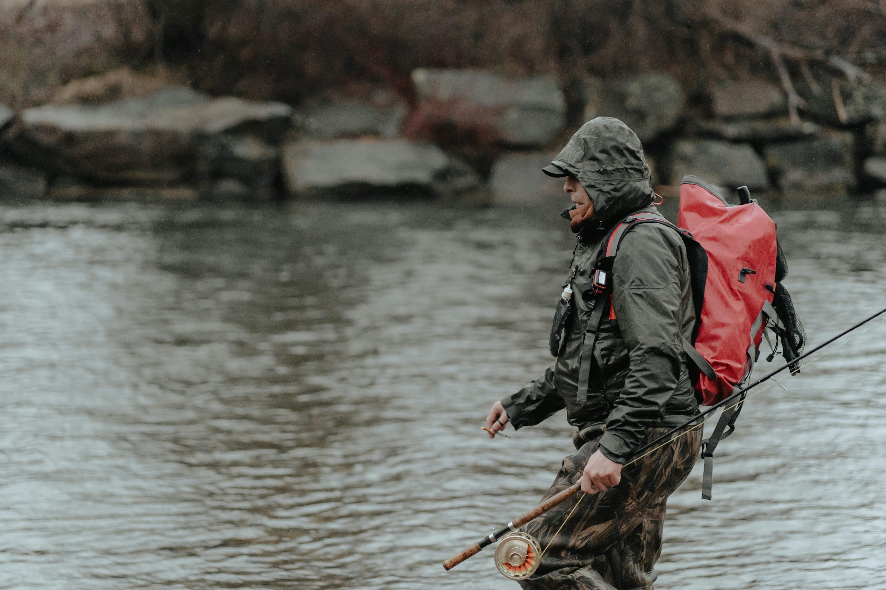

# Machine Learning - Laboratorio 2 

Objetivo:

Utilizar los algoritmos KMeans, Clustering Jerárquico y Gaussian Mixtures. 

Deberá subir una foto:

 

Obtener su escala de colores (mínimo 3 colores y máximo el ideal comparativo encontrado por scree-plot). recomponer la imagen exclusivamente con esa escala reducida.
Ajustar Kmeans, realizar análisis de clustering jerárquico y ajustar siempre utilizando SKLearn mezclas de gaussianas.
